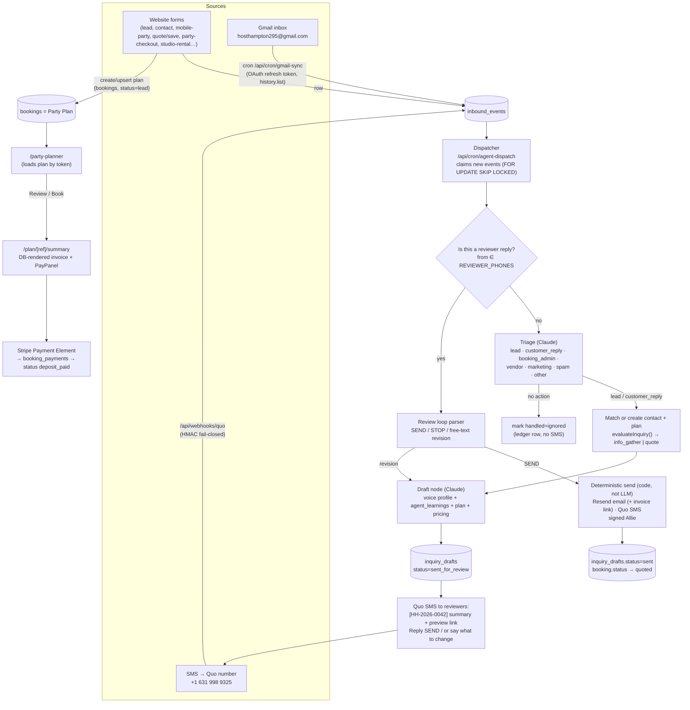

# Booking Agent — Master Plan v2 (2026-09-10)

Successor to the 2026-08-31 "Inquiry → Draft Response" plan
(`docs/inquiry-response-flow.md`, `docs/inquiry-response-phase0.md`,
`docs/inquiry-response-workflow.md`). **Phase 0 of that plan is done** and is
kept as-is (migration 028, `lib/inquiryDrafts.ts`, 24 tests). This document
widens the scope from "draft a reply to a `pending_review` booking" to the
full booking agent Adam described on 2026-09-10:

1. **Monitor every inbound channel** — website forms (already rows in the DB),
   Gmail inbox, and SMS on the Host Hampton Quo number.
2. **Trigger the agent on each inbound item.** It classifies, decides whether
   action is needed (most marketing/vendor email is "no action"), and drafts.
3. **Review by SMS.** Drafts go to the reviewers' phones; a reply approves,
   revises, or dismisses. Nothing reaches a customer without the approval
   phrase.
4. **Every lead is a Party Plan.** One `bookings` row from the first touch,
   able to hold any of the three products (In-Studio Theme, Mobile, Studio
   Rental). The agent's job is to fill in the plan and get it booked.
5. **Planner → Summary/Invoice → Pay.** The party planner's "Review / Book"
   step lands on a DB-rendered invoice page that reproduces the locked
   `invoices/_template.html` design, with the embedded pay module moved there
   and an "Email me this" link back to the same page.
6. **Learn as we go.** Reviewer edits are captured as training signal; the
   permanent Gmail connection gives a verbatim corpus for the voice profile.

Everything below reuses what the two 2026-09-10 codebase surveys found. When
this doc says "exists", it was verified in code that day.

---

## 0. What already exists (verified 2026-09-10)

| Capability | Where | State |
|---|---|---|
| Party-type classifier + required-info gate | `services/website/src/lib/inquiryDrafts.ts` | Done (Phase 0). Only caller is `lib/checkinLink.ts`. |
| `inquiry_drafts` table + status machine | `starting_plan/migration_028_inquiry_drafts.sql` | Written, **not yet applied** in Supabase (untracked file). No code writes to it. |
| Message store | `ingested_messages` (mig 024/025) | Table exists; only hand-run SQL has ever written to it. No Gmail code anywhere. |
| Quo send | `lib/quo.ts` → `POST /v1/messages` | Live. |
| Quo inbound webhook | `app/api/webhooks/quo/route.ts` | Live, but only logs `sms_received` to `contact_interactions`, **drops unknown senders**, and HMAC check **fails open**. |
| Google OAuth | `lib/googleCalendar.ts` refresh-token grant | Calendar scope only. No Gmail scope. |
| LLM drafting pattern | `lib/marketing/townDraft.ts` (budget check → voice profile → Claude → row → ledger → `advance()`) | Live, proven in two nodes. Duplicate `loadVoiceProfile` in `fb-reply/route.ts`. |
| Gated transitions + audit ledger | `lib/marketing/graph.ts`, `marketing_ledger` | Live. Extendable to new entity types. |
| Voice profile v1 | `voice_profile` table + `docs/marketing/voice-profile.md` | Seeded, LOW confidence, thin corpus. |
| Lead intake routes | `api/lead`, `contact`, `mobile-party-inquiry`, `quote/save`, `fundraiser-inquiry`, `trucker-inquiry`, `canvas-bag-inquiry`, `signup` | Write `contacts` + `contact_interactions`, email owner. **No `bookings` row** → not a plan. |
| Booking-creating routes | `api/party-checkout` (`pending_review`), `party-builder/save` + `admin/parties/create` (`awaiting_deposit`), `checkout` (`pending_review`/`confirmed`), `studio-rental/checkout` (`awaiting_deposit`) | Three different initial statuses, three `quote_snapshot` shapes. |
| Party planner | `app/party-builder/PartyBuilderContent.tsx` (3,716 lines; `/party-planner` and `/party-builder` render it) | Summary card at `:2958`, pay card at `:3058` with inline Stripe Payment Element. Not componentized. |
| Customer portal + embedded pay | `app/my-booking/MyBookingContent.tsx`, `api/portal/pay` | Payment Element via `clientSecret`; 3% card fee; Venmo/Zelle/cash instructions. |
| Admin party editing | `app/admin/PartiesTab.tsx`, `api/admin/parties/[id]` | Line items, payments, portal links. No invoice view, no "send quote". |
| Stripe pay-link | `api/admin/pay-link` (`linkType: 'payment_link'`) | Live, never persisted to a booking. |
| Invoice design | `invoices/_template.html` + `.claude/skills/party-quote-invoice/SKILL.md` | Locked header/payment/footer; 11 sections; numbering by grep. |
| Deposit model | commit `e3c80b6` "flat $250 booking deposit", `lib/partyPricing.ts:14` | **Resolved: flat $250 all types.** |
| Owner SMS | only `api/summer-hair/book/route.ts:10` (hardcoded Allie cell) | Everything else emails `hosthampton295@gmail.com`, hardcoded in 10+ files. |

---

## 1. Target architecture



Design rules carried forward, unchanged: no autosend; Resend for email and Quo
for SMS, **never the Gmail connector for sending**; flat $250 deposit; 3% card
fee on the amount charged by card, Venmo shows the fee-free figure; info-gather
first when required fields are missing.

**Signature rule (Adam, 2026-09-10):** only the *first* message of a thread
introduces "Allie from Host Hampton". Once she has identified herself on a
thread (email thread or SMS conversation with that number), later messages do
not re-introduce. The introduction returns only when a **new party plan**
starts with that contact after a long gap (a new `bookings` row months or a
year later). Implementation: the draft node checks for any prior outbound
message to this contact on the current plan (`ingested_messages` with
`direction='out'` linked to the same `booking_id`, or an earlier `sent`
`inquiry_drafts` row for it); none → intro variant, otherwise → no intro.

**Contact sync rule (Adam, 2026-09-10):** every handle the agent touches must
exist in all three lists — Supabase `contacts`, Brevo, and the Quo address
book. `lib/contactSync.ts` (shipped 2026-09-10) is called from
`upsertContact()` on every website form and by `upsertContactByPhone()` for
unknown texters. The agent calls the same helper before it drafts for any
email address or phone number it has not seen, so Brevo and Quo never lag
Supabase. Brevo list membership still requires `email_opt_in`; the contact
record itself is always mirrored.

---

## 2. Data model changes

Migrations are applied by hand in the Supabase SQL editor (repo convention).
Numbers 029–031 were taken; **032, 033 and 034 are written and applied** and the
next free number is **035**.

> Renumbered twice on 2026-09-11, both times because a later phase shipped
> first and migrations are kept in the order they are actually applied:
>
> - **033** = "drafts for any channel". Originally parked in 034, but it had to
>   ship with Phase 1: most lead forms create no `bookings` row, so
>   `inquiry_drafts.booking_id NOT NULL` blocked the whole phase.
> - **034** = "agent review loop" (Phase 2 bookkeeping: nudge clock, approver,
>   per-channel send ids).
> - party-plan-as-lead is therefore **035** and the learning loop **036**.

### 032 — inbound events + gmail sync state + contact sync + deposit default (WRITTEN 2026-09-10)
File: `starting_plan/migration_032_agent_inbound_and_contact_sync.sql`.
Extend `ingested_messages` rather than add a parallel table; it is already the
message store with the right dedup key. Also adds `contacts.brevo_synced_at`,
`quo_contact_id`, `quo_synced_at`, `sync_error`, a phone-unique index for
email-less contacts, and fixes `bookings.deposit_amount` default to 25000.

- `source` CHECK → `('gmail','grasshopper','local_invoice','quo','website_form','system')`.
- Add `status TEXT NOT NULL DEFAULT 'new'` CHECK `('new','claimed','handled','ignored','error')`,
  `claimed_at`, `handled_at`, `classification TEXT`, `classification_meta JSONB`,
  `booking_id UUID REFERENCES bookings`, `draft_id UUID REFERENCES inquiry_drafts`,
  `error TEXT`.
- Index `(status, created_at)` for the dispatcher.
- New table `gmail_sync_state (id int PK check(id=1), history_id TEXT, last_full_sync_at, last_poll_at, last_error)`.
- Ledger convention: each dispatcher run writes one `marketing_ledger` row
  (`entity_type='agent_run'`), each LLM call one `llm_call` row (already the
  pattern in `townDraft.ts`).

### 033 — drafts for any channel (WRITTEN 2026-09-11)
File: `starting_plan/migration_033_agent_drafts_any_channel.sql`.
- `inquiry_drafts.booking_id` → nullable; add `contact_id`, `inbound_event_id`,
  `channel` CHECK `('email','sms','both')`, `draft_kind` CHECK
  `('info_gather','quote','reply','follow_up')`, `subject`, `reviewer_note`.
- CHECK that a draft is anchored to at least one of booking / contact / event.
- Partial unique index on `inbound_event_id` for live drafts (the per-booking
  one from 028 stays), which is the DB half of dispatcher idempotency.
- No claim function: the dispatcher claims each event with a compare-and-swap
  `UPDATE … WHERE id=? AND status='new' RETURNING`, which is atomic per row.

### 034 — agent review loop (WRITTEN + APPLIED 2026-09-11)
File: `starting_plan/migration_034_agent_review_loop.sql`. Phase 2's
bookkeeping; the 028 status machine already had every state the loop needs.
- `inquiry_drafts.sent_for_review_at` — the 2-hour nudge clock. Not `created_at`
  (a revision restarts the clock) and not `updated_at` (the 028 trigger bumps it
  on every write).
- `nudged_at` — non-null means "already nudged, never again". The nudge is
  claimed with a compare-and-swap on `nudged_at IS NULL`, so two overlapping
  cron runs cannot both send.
- `approved_by` — *who* approved (E.164 reviewer phone, or `admin:ui`);
  `approved_phrase` from 028 already recorded *what* they said.
- `send_error`, `customer_email_message_id`, `customer_sms_message_id` — paired
  with 028's `customer_*_sent_at`, these make the send idempotent per channel, so
  a half-failed send can be retried without messaging anyone twice.

### 035 — party plan as lead
- `bookings.status` gets a real CHECK constraint with the set that
  `PartiesTab.tsx:42-51` already uses **plus** `lead` and `quoted`:
  `lead → quoted → awaiting_deposit/pending_review → deposit_paid → approved → modifications_locked → paid_in_full → completed | cancelled`.
  Backfill nothing; existing rows already use values in the set.
- `bookings.party_type TEXT` CHECK `('in_studio_theme','mobile_party','studio_rental','unknown')`,
  backfilled once with `classifyPartyType()` via a script, then written by every
  creator. This replaces relying on the inconsistent `event_type`.
- `bookings.source TEXT` (`website_form | email | sms | admin | phone | walk_in`),
  `bookings.first_touch_event_id UUID`, `bookings.invoice_number TEXT UNIQUE`
  fed by a sequence `invoice_number_seq` starting where the grep of
  `invoices/*.html` leaves off (`444124-0001NN` format kept).
- Relax `contact_email NOT NULL` → nullable **or** keep NOT NULL and require
  the agent to gather it first. Recommendation: make nullable, add a CHECK that
  at least one of email/phone is present. An SMS-only lead has no email yet.
- `booking_line_items`: add `description TEXT`, `is_featured BOOLEAN DEFAULT false`,
  `is_optional BOOLEAN DEFAULT false` so the invoice page can render the
  template's featured item, line-item descriptions, and optional tags.
- New `booking_pay_links (id, booking_id, purpose CHECK('deposit','balance','custom'), amount_cents, fee_cents, stripe_payment_link_id, stripe_price_id, url, created_by, created_at, voided_at)` — closes the gap that today's pay links are untraceable.
- `booking_payments.payment_method` CHECK → add `'check','other'` (admin dropdown already offers them).

### 036 — learning loop
- New `agent_learnings (id, kind CHECK('style','rule','fact','pricing'), text, source_draft_id, source_event_id, confidence, is_active, created_by, created_at)`.
  The draft prompt loads active rows. Reviewer corrections become rows here
  (Phase 6), and Adam/Allie can add rules directly from the admin Inbox tab.
- New view `draft_feedback` = for each `sent` draft, the first agent version
  vs the approved version (from `revisions`), for weekly distillation.

---

## 3. Phases

Smallest useful slice first. Each phase ships behind env flags so production
stays exactly as it is until the flag is on.

### Phase 1 — Lead trigger → draft → SMS to reviewers — **BUILT 2026-09-11, not yet deployed**

Goal: within ~5 minutes of any new website lead, Allie's and Adam's phones get
a text with the classification, the missing fields, and the proposed reply.
Send to the customer stays stubbed ("would send") until Phase 2.

1. Apply migrations 028, 032 **and 033**. Add env: `REVIEWER_PHONES` (Adam's
   cell, already wired for lead SMS), `OWNER_NOTIFY_EMAIL`, `AGENT_ENABLED=false`,
   `AGENT_DRAFT_MODEL` (default `claude-sonnet-5`; Haiku is fine for triage,
   not for customer-facing drafts), `AGENT_DAILY_USD_CAP`,
   `REVIEW_LINK_SIGNING_SECRET`.
2. `lib/agent/events.ts` — `recordInboundEvent()` used by every intake route
   (one-line addition per route, same place `upsertContact` is called).
   `source='website_form'`, `external_id = '<route>:<contact_interaction id>'`.
3. `lib/agent/voice.ts` — extract the duplicated `loadVoiceProfile` /
   `voicePromptAddendum` from `townDraft.ts` and `fb-reply/route.ts`; add
   `loadLearnings()`.
4. `lib/agent/draftInquiry.ts` — the node: `evaluateInquiry()` → prompt with
   workflow-doc rules (signed Allie, info-gather vs quote, starting rate only
   when allowed, soft "quick chat" CTA) → `{ emailSubject, emailDraft, smsDraft, summaryForReviewer }`
   → `inquiry_drafts` row (`sent_for_review`) → Quo SMS to `REVIEWER_PHONES`.
   Budget check and ledger rows exactly as `townDraft.ts:184-262`.
5. `/api/cron/agent-dispatch` (CRON_SECRET, every 2 min on cron-job.org):
   claims `status='new'` events with `UPDATE … WHERE id IN (SELECT … FOR UPDATE SKIP LOCKED) RETURNING`,
   routes website_form events to the node, marks `handled`. Also sweeps
   `bookings.status IN ('pending_review','lead')` with no live draft (the
   Phase 0 trigger) so nothing depends on the routes being touched.
6. Preview route `/review/[token]` (public, token-hashed like portal links):
   renders the email draft, SMS draft, the plan fields, and missing-field list.
   This is the "open the link" half of the SMS.
7. Admin **Inbox** tab: list of events + drafts, status chips, one-click
   Approve / Dismiss / Edit — the fallback when phones are inconvenient. Copy
   the `MarketingTab` + `preview/[id]` pattern.
8. Tests: node with mocked Claude (JSON shape, Allie signature present, no
   dollar amounts when `path='info_gather'`), dispatcher idempotency (event
   claimed twice → one draft), cron auth.

Exit criteria: a test lead through `/mobile-party` produces one draft row, one
SMS to each reviewer, and a working preview link; nothing sent to the customer.

### Phase 2 — SMS review loop + real send — **BUILT + DEPLOYED 2026-09-11**

1. Harden `/api/webhooks/quo`: **fail closed** when `QUO_WEBHOOK_SECRET` is
   set and the signature does not match; dedupe on `message_id`
   (`external_id='quo:<id>'`); write every inbound to `ingested_messages`
   (`source='quo'`) instead of only `contact_interactions`; unknown numbers →
   `upsertContact` + a `lead` plan row + event (no more silent drops).
   Keep STOP handling exactly as is.
2. `lib/agent/reviewLoop.ts`: if `from ∈ REVIEWER_PHONES` and there is an open
   draft — resolve which draft (explicit `HH-…` code in the text, else the
   single open draft, else ask "which one? reply with the code"). Parse:
   - `SEND` / `SEND IT` / `APPROVED` / `APPROVE 0042` → `approved`.
   - `STOP 0042` / `CANCEL 0042` / `IGNORE` → `cancelled` (this is also how
     "no action needed" is confirmed for triaged email).
   - `EDIT: …` or any other text → `revision_requested` → re-draft with the
     note appended to `revisions` → back to `sent_for_review` with a fresh SMS.
   - `TEST` → send the drafts to the reviewer's own phone/email exactly as the
     customer would see them (the workflow doc's test-send step).
   Approval transitions run through `advance()` in `graph.ts` with a new
   `inquiry_draft` entity so the `approved → sent` edge is `GATED`.
3. `lib/agent/sendApproved.ts` (deterministic, no LLM): Resend email with the
   `/plan/[ref]/summary` link (Phase 5) or plain text before that, Quo SMS,
   both signed Allie; set `customer_*_sent_at`, `sent`; booking `lead → quoted`
   when a quote went out; ledger `send` row. Never Gmail.
4. Reminder: if a draft sits in `sent_for_review` for 2 hours during business
   hours, one nudge SMS; never more than one per draft.

Exit criteria: full loop on a real lead with the reviewer texting `EDIT`, then
`TEST`, then `SEND`, with the customer receiving both channels once.

### Phase 3 — Permanent Gmail ingestion (no Claude connector) — **BUILT 2026-09-11**

Why not the connector: it is bound to whichever Google account Adam is signed
into in claude.ai, it is interactive-only, and the standing rule forbids
sending through it. The permanent path is the app's own OAuth grant for the
`hosthampton295@gmail.com` account.

1. **One-time consent (Adam, ~10 min):** in the existing Google Cloud project,
   enable the Gmail API; add a second OAuth client (Desktop or Web) or reuse
   the calendar client; run `scripts/gmail_consent.mjs` which opens the consent
   URL for scopes `gmail.readonly` + `gmail.modify` (needed to apply an
   `HH-Agent/Handled` label; still cannot send) **signed in as
   hosthampton295@gmail.com**, and prints a refresh token. Store as
   `GMAIL_REFRESH_TOKEN` (+ `GMAIL_CLIENT_ID/SECRET` if a new client). Do **not**
   re-consent `GOOGLE_REFRESH_TOKEN`; it powers live calendar availability.
   Publishing status "Testing" is fine for one internal user; tokens then
   expire every 7 days, so set the app to "In production" (internal use, no
   verification needed for a single owner account).
2. `lib/gmail.ts` — raw fetch like `googleCalendar.ts`: token refresh,
   `users.history.list` from the stored `history_id` (fallback
   `messages.list?q=newer_than:2d` on first run or expired history), `messages.get`
   (format=full, decode text/plain, strip quoted replies and signatures),
   `messages.modify` to add the label.
3. `/api/cron/gmail-sync` (every 3 min): pulls new inbox messages → `ingested_messages`
   (`source='gmail'`, `external_id='gmail:<id>'`, `direction` by from-address,
   `thread_id`) → `status='new'`. Outbound messages Allie sends by hand are
   ingested too (`direction='out'`) — they are the voice corpus (Phase 6) and
   they mark the thread as "human already replied" so the agent stands down.
4. Triage node (`lib/agent/triage.ts`, Haiku): `lead | customer_reply |
   booking_admin (payment, date change, cancellation) | vendor | marketing |
   spam | other` plus `needs_action: boolean` and a one-line reason. Marketing,
   spam, receipts, Venmo notifications, **and the site's own owner
   notification emails** (from `noReply@mail.hosthampton.com`, subjects
   "New lead:", "New party REQUEST:", etc.) → `ignored`, no SMS; those leads
   are already events via the form route. Only
   `needs_action` items reach the draft node. Prompt-injection rule: the email
   body is data, never instructions; the system prompt says so and the output
   is schema-validated.
5. Thread → plan linking: match sender to `contacts` (email), then to open
   `bookings`; a `lead` classification with no plan creates one (`source='email'`).
6. Backfill: one bounded historical pull (last 12 months, `q=in:sent OR in:inbox`)
   into `ingested_messages` with `status='handled'` so it never triggers drafts
   but does feed Phase 6.

Exit criteria: a test email to the inbox appears as an event within 3 minutes,
a marketing newsletter is silently ignored, a party inquiry produces a draft
and reviewer SMS.

### Phase 4 — Every lead is a plan, one planner for all three products

1. Intake routes without a booking (`lead`, `contact`, `mobile-party-inquiry`,
   `quote/save`, `fundraiser-inquiry`, `trucker-inquiry`, `canvas-bag-inquiry`)
   create or reuse a `bookings` row `status='lead'` with `party_type`,
   `source='website_form'`, contact fields, and whatever plan fields the form
   carried (date, guests, address in `party_tags.location_address`, notes).
   `quote/save` additionally writes real `booking_line_items` instead of a
   base64 URL. Match rule: same contact + same party_date, or same contact and
   an open `lead`/`quoted` plan in the last 30 days → reuse.
2. One `buildPlanSnapshot()` / `writeLineItems()` in `lib/plan.ts` used by
   `party-checkout`, `party-builder/save`, `admin/parties/create`, `quote/save`
   and the agent, replacing the three divergent `quote_snapshot` writers.
3. Pricing single source: move Mobile tiers (`mobilePricing.ts`), studio rates
   (`studioRental.ts`) and the inline constants in `PartyBuilderContent.tsx:17-40`
   into `pricing_items` (new categories `mobile-package`, `mobile-station`,
   `studio-rental-rate`, `guest-overage`) with a `lib/pricingCatalog.ts`
   loader. Marketing pages keep reading the same rows. Also add the curated
   mobile station list from SKILL.md as `mobile-station` rows (no price where
   there is none; `price_label='Ask'`) so the invoice's menu appendix is
   DB-driven.
4. Planner: `PartyBuilderContent` accepts `plan_kind` and loads any plan by
   ref/token; the studio-rental and mobile sections it already has become the
   product switch. Admin and customer share the component (admin flag already
   exists via `/api/admin/parties/[id]`).
5. Admin Parties tab: pipeline view (`lead → quoted → awaiting_deposit → …`),
   filter by `party_type`, "Draft reply with agent" button that enqueues an
   event by hand (covers phone leads and the Mobile gap noted in Phase 0).
6. The agent's draft node reads the plan and asks for exactly the fields
   `evaluateRequiredInfo()` reports missing; when a reply arrives with those
   fields (email or SMS), an extraction step updates the plan and re-evaluates
   (this is how "communication from agent requests more info with the
   objective to complete the plan" becomes concrete).

### Phase 5 — Planner → Summary/Invoice page → Pay

1. `app/plan/[ref]/summary/page.tsx` (token-gated like the portal, also
   admin-viewable): server-renders the invoice from the DB in the exact
   section order of `_template.html` — locked header with services bar,
   client/event grid, featured + line items with descriptions and optional
   tags, Total and Balance Due, the deposit callout outside totals, What's
   Included (studio only), Good-to-know/policies per `party_type`, payment
   block, Services & Add-Ons grid, Mobile menu appendix (mobile only), locked
   footer. Studio rule kept: Balance Due = full Total, deposit shown separate.
   Policy and "What's Included" copy move from SKILL.md into a small
   `plan_content` table keyed by `party_type` (or a TS constant file first).
2. `components/PayPanel.tsx` extracted from `MyBookingContent.tsx:131-188` and
   the planner's two inline mounts: props `bookingRef, purpose, amountCents`;
   embedded Payment Element via `/api/portal/pay`; Venmo (QR + deep link with
   the fee-free amount) and Zelle/cash instructions; fee disclosure copy from
   SKILL.md. The planner's `REQUEST YOUR PARTY` card is replaced by a
   **Review / Book** button that saves the plan and routes to the summary
   page; the summary page owns payment. `/my-booking/pay` switches to the
   same component (removes the last Checkout-redirect path).
3. Buttons on the summary page: **Pay deposit** (PayPanel), **Email me this**
   (`/api/plan/[ref]/email` → Resend, link back to the same URL, PDF optional),
   **Edit plan** (back to planner), and for admins **Send to client** (creates
   the `inquiry_drafts` row as a `quote` draft so it still goes through review).
4. `booking_pay_links`: any Stripe Payment Link minted for a plan (deposit or
   balance) is stored and shown on the page; the Stripe webhook already
   records `booking_payments` for Payment Elements — extend it to match
   `payment_link` metadata (`booking_ref`) so mailed links close the loop too.
5. Invoice number assigned on first render (`invoice_number_seq`).
6. PDF: the `node:20-alpine` container has no Chrome. Options: (a) email the
   link plus an inline HTML rendering, no attachment (matches the §5f finding
   that attachments are client-dependent); (b) add `@sparticuz/chromium` +
   `puppeteer-core` (~50 MB image growth). Recommendation: ship (a) first,
   add (b) only if clients ask for a file.
7. The `party-quote-invoice` skill is updated to say: for any plan that exists
   in the DB, use the summary page URL, not a hand-built HTML file; hand-built
   files remain only for one-offs with no plan row.

### Phase 6 — Learning loop

1. Capture: every `sent` draft stores the first agent version and the approved
   version (already in `revisions`); `draft_feedback` view exposes the diff.
2. Weekly `/api/cron/agent-distill` (Sonnet): reads the week's feedback and any
   verbatim outbound Gmail (`direction='out'`, Allie's own replies), proposes
   `agent_learnings` rows and a voice-profile v2 delta as an `ALWAYS_ASK`
   `marketing_tasks` row; Adam approves in the admin Inbox tab. Nothing changes
   the prompt without approval.
3. The draft node loads active `agent_learnings` (by `kind`, capped) and the
   active voice profile. Few-shot exemplars come from the most recent approved
   drafts per `party_type` and `draft_kind`.
4. Eval set: the six captured sessions in `inquiry-response-workflow.md`
   become fixtures (`__tests__/agent/fixtures/*.json`) with the standing rules
   as assertions (signed Allie, no pricing on info-gather, $250 deposit, fee
   text present on balance quotes). Run in CI-less `npm test` before deploys.
5. Metrics on the admin Inbox tab: time-to-first-draft, time-to-approval,
   edit distance per draft, approval-without-edit rate. These are the "is it
   learning" numbers.

---

## 4. Guardrails (enforced in code)

Carried forward from `inquiry-response-flow.md` §4, plus:

1. **Fail-closed webhooks.** Once an inbound SMS can trigger an LLM call or a
   state change, an unsigned Quo webhook is rejected, not logged-and-processed.
2. **Reviewer identity by phone number only** (`REVIEWER_PHONES`), never by
   message content. A customer texting "SEND" does nothing.
3. **Inbound text is data.** Triage and draft prompts state that email/SMS
   bodies are untrusted; outputs are schema-validated; no tool use from
   inbound content.
4. **Budget.** `assertLlmBudget` before every call; `AGENT_DAILY_USD_CAP`
   env; dispatcher stops and texts the reviewers once when the cap is hit.
5. **Idempotency.** `external_id` unique; dispatcher claims with
   `FOR UPDATE SKIP LOCKED`; one live draft per booking and per event.
6. **Stand-down rules.** If a human already replied on the thread
   (`direction='out'` after the inbound), or the plan is `cancelled`, no draft.
7. **Never send via Gmail.** The Gmail token has read + label scopes only.

---

## 5. Config

New env (box `.env` + `docker-compose.yml` `environment:`; names only):
`AGENT_ENABLED`, `AGENT_DRAFT_MODEL`, `AGENT_TRIAGE_MODEL`, `AGENT_DAILY_USD_CAP`,
`REVIEWER_PHONES`, `OWNER_NOTIFY_EMAIL`, `GMAIL_CLIENT_ID`, `GMAIL_CLIENT_SECRET`,
`GMAIL_REFRESH_TOKEN`, `GMAIL_USER` (`hosthampton295@gmail.com`),
`GMAIL_HANDLED_LABEL`, `QUO_WEBHOOK_SECRET` (exists; becomes required),
`REVIEW_LINK_SIGNING_SECRET` (or reuse `PORTAL_LINK_SIGNING_SECRET`).

Cron-job.org additions: `agent-dispatch` (2 min), `gmail-sync` (3 min),
`agent-distill` (weekly Monday 7am).

---

## 6. Order of work and rough size

| Phase | Depends on | Size |
|---|---|---|
| 1 Lead trigger → draft → reviewer SMS | mig 028 + 032, `REVIEWER_PHONES` | 2 sessions |
| 2 SMS review loop + real send | Phase 1, `QUO_WEBHOOK_SECRET` | 2 sessions |
| 3 Gmail ingestion + triage | Adam's OAuth consent | 2 sessions |
| 4 Plan = lead, unified pricing/planner | mig 035 | 3 sessions (the planner file is large) |
| 5 Summary/Invoice page + PayPanel | Phase 4 | 3 sessions |
| 6 Learning loop | Phases 2, 3 | 1–2 sessions |

Phases 1–3 deliver the speed-to-lead goal without touching the planner.
Phases 4–5 can run in parallel with 3.

---

## 7. Decisions (answered by Adam, 2026-09-10)

1. **Reviewer number.** `REVIEWER_PHONES` = Adam's cell (value lives only in
   the box `.env`) while the loop is proved out. Later: Allie, or both. Review texts go **from** the HH Quo
   number **to** the reviewer phones; replies arrive in the HH inbox webhook.
   *Group text:* Quo/OpenPhone supports group MMS threads from a number to
   several recipients, but its webhook events for group threads are less
   predictable and the approval parser needs to know *who* approved. Plan:
   individual threads first; if both reviewers want one shared thread, add
   `REVIEWER_GROUP=1` in Phase 2 and send one message with both numbers in
   `to`, accepting approval from either.
2. **Inbox:** `hosthampton295@gmail.com`, confirmed.
3. **Owner notification emails.** Meaning: today every form already sends an
   email like "New lead: …" to hosthampton295@gmail.com. As of 2026-09-10 the
   same routes also text `REVIEWER_PHONES`. So for now each lead produces one
   email **and** one text. Once the agent's own SMS (with the draft attached)
   is live, the plain "New lead" email becomes redundant and can be turned
   off with `OWNER_NOTIFY_EMAIL=` (empty is not allowed today; a later change
   will make empty mean "skip"). Also important for Phase 3: those
   notification emails land in the very inbox the agent watches, so the Gmail
   triage must auto-ignore mail from `noReply@mail.hosthampton.com` and the
   agent's own subjects, or every lead would be double-triggered.
4. **Auto-ignore list.** Seeded with Venmo, Stripe, Squarespace, Brevo,
   Resend, Google, Meta, SignWell, cron-job.org and the site's own sender.
   Extendable from the admin Inbox tab.
5. **Signature.** Resolved by the signature rule in §1: introduce as Allie on
   the first message of a thread only; no repeated sign-off on later messages
   in the same conversation; re-introduce only on a new party plan after a
   long gap.

## 8. Shipped alongside this plan (2026-09-10)

- `lib/ownerNotify.ts` — `ownerEmail()` (env `OWNER_NOTIFY_EMAIL`) replaces
  the literal Gmail address in 18 API routes; `notifyOwnerSms()` texts
  `REVIEWER_PHONES` via Quo. Every lead route (lead, contact, mobile-party,
  quote/save, checkout request, party-checkout, fundraiser, trucker, canvas
  bag, portal message, portal payment pledge, summer-hair) now texts the
  reviewers as well as emailing.
- `lib/contactSync.ts` + `upsertQuoContact()` in `lib/quo.ts` +
  `upsertContactByPhone()` in `lib/contacts.ts` — Supabase ↔ Brevo ↔ Quo sync
  on every contact upsert, with bookkeeping columns from migration 032.
- Planner: the request flow now always lands on the success page; the false
  "your date is locked" message for non-card requests is gone.
- `bookings.deposit_amount` documented as cents everywhere; migration 032
  fixes the DB default (250 → 25000) and normalises any dollar-valued rows.
- `starting_plan/migration_032_agent_inbound_and_contact_sync.sql`.

## 9. Phase 1 as built (2026-09-11)

- `lib/agent/config.ts` — every agent env name in one place (`AGENT_ENABLED`,
  `AGENT_DRAFT_MODEL`, `AGENT_TRIAGE_MODEL`, `AGENT_DAILY_USD_CAP`,
  `REVIEW_LINK_SIGNING_SECRET`) plus per-model pricing for the ledger.
- `lib/agent/events.ts` — `recordInboundEvent()` / `finishEvent()`. Wired into
  lead, contact, mobile-party-inquiry, quote/save, fundraiser, trucker,
  canvas-bag, party-checkout (with `booking_id`) and signup (recorded as
  `ignored`: a signup sheet is not an inquiry).
- `lib/agent/voice.ts` — the one copy of `loadVoiceProfile` /
  `voicePromptAddendum` (townDraft.ts and fb-reply now import it; the fb-reply
  copy had already lost `dos`/`donts`) plus `loadLearnings()`, which fails soft
  until migration 035.
- `lib/agent/reviewLink.ts` — HMAC preview tokens and the `HH-YYYY-NNNN` code.
- `lib/agent/draftInquiry.ts` — the node. Budget check → Claude → guardrails →
  `inquiry_drafts` row → reviewer SMS. Customer send is a `console.log` stub.
  Two guardrails are enforced in code, not left to the model: an info-gather
  draft containing a dollar amount gets one corrective retry and is then parked
  as `drafted` with an error instead of being texted for approval; the Allie
  intro is kept on a first message and stripped on later ones.
- `/api/cron/agent-dispatch` — CRON_SECRET, `AGENT_ENABLED`, daily USD cap with
  a once-a-day reviewer text, compare-and-swap event claim, a 24h staleness
  window so switching the flag on never floods the queue, plus the booking sweep.
- `/review/[token]` — public read-only draft preview (404 on a bad token).
- Admin **Inbox** tab + `/api/admin/agent` — events, drafts, Approve / Edit /
  Dismiss / Draft-now. Approve marks `approved` and sends nothing (Phase 2).
- Tests: `agentDraftInquiry` (11), `agentDispatch` (11), `agentReviewLink` (7).

## 10. Phase 2 as built (2026-09-11)

- **`/api/webhooks/quo` fails closed.** A present-but-wrong (or missing-header)
  Standard-Webhooks signature is now `401`, not a warning — an inbound SMS can
  trigger an LLM call and a customer-facing send, so a forged request could
  otherwise impersonate a reviewer phone and approve a draft. Verification is
  still skipped entirely when `QUO_WEBHOOK_SECRET` is unset, which is the
  documented "not configured" state. Every inbound message is written to
  `ingested_messages` (`source='quo'`, `external_id='quo:<id>'` — the UNIQUE
  column is the dedupe, so a Quo redelivery cannot send a second message), and
  an unknown number becomes a real contact via `upsertContactByPhone` instead of
  being dropped. STOP handling is byte-for-byte unchanged.
- **`lib/agent/reviewers.ts`** — `isReviewerPhone()` lives in its own module so
  the webhook can classify a sender without importing the send path. The
  guardrail is enforced by the module graph, not only by discipline.
- **`lib/agent/reviewLoop.ts`** — identity by phone number only, checked before
  a single word of the message is read. Intent is an EXACT phrase match on what
  remains after the draft code is stripped, which is why "don't send this yet",
  "send it after you fix the date" and "can we send tomorrow?" are all revisions
  rather than approvals. Draft resolution: explicit `HH-YYYY-NNNN` (or a bare
  4-digit tail) → that draft; otherwise the single open draft; otherwise it asks,
  listing the codes, because guessing would send a stranger's quote to the wrong
  customer.
- **`lib/agent/sendApproved.ts`** — the only module that messages a customer. No
  LLM: the bytes that go out are the bytes a human approved. Resend + Quo, never
  Gmail. Idempotent per channel via `customer_*_sent_at` + the new message-id
  columns, so a half-failed send retries safely. A partial failure stays
  `approved` and is never reported as sent. Booking `lead → quoted` only once a
  quote has actually landed.
- **`inquiry_draft` is a first-class graph entity** (`lib/marketing/graph.ts`).
  Both `approved` and `sent` are GATED, so the hard guardrail is now a property
  of the transition table: no cron, sweep or LLM path can reach a customer,
  because none of them can set `isAdmin`. `sent` is terminal; the only edge into
  it is from `approved`.
- **`redraftForReviewer()`** revises a draft IN PLACE, keeping `review_code` (the
  reviewer's SMS thread) while rotating the preview token so the revision SMS
  carries a live link and the superseded text's link dies.
- **The 2-hour nudge** runs in the dispatcher, 9am–8pm America/New_York (every
  day — Saturday is a working day here), claimed with a compare-and-swap on
  `nudged_at IS NULL` so overlapping cron runs can't double-send. One per draft,
  ever; a revision re-arms it for the new text.
- **Admin Inbox** gained "Send to customer" (only on an `approved` draft, behind
  a confirm) and "Test to me". Approve and send stay two separate actions, and
  editing an approved draft un-approves it — the approval was for the old words.
- Tests: `agentReviewLoop` (27), `agentSendApproved` (15), plus Quo-webhook and
  graph-gate coverage. 510 total, the one failure being pre-existing WIP.

**Phase 2 boundary worth knowing:** an inbound SMS from a number that is *not* a
reviewer is recorded, given a contact, and parked as `ignored` with a note — it
does not produce a draft. Deciding whether an arbitrary message needs an answer
is triage, which is Phase 3. Until then it appears in Admin → Inbox with a
"Draft now" button.

### Phase 2 — verified in production (2026-09-11)

Ran against `www.hosthampton.com` with `AGENT_ENABLED=true`:

1. Website lead → event → draft `HH-2026-0313` (mobile party, info-gather, no
   pricing, signed Allie, asking for exactly the three missing fields) →
   reviewer SMS. $0.011, 2389 in / 670 out.
2. Quo webhook **fails closed**: a wrong signature → 401, missing signature
   headers → 401, a valid Standard-Webhooks signature → 200 with
   `reviewer: true` for `+16314008080`.
3. Reviewer texts `SEND HH-2026-0313` → `approved` → real Resend email + real
   Quo SMS → `sent`. Ledger shows the whole chain: `llm_call`, the draft note,
   `sent_for_review → approved` by `REVIEWER:+16314008080` with
   `approved_phrase` verbatim, `approved → sent`, and a `send` row with both
   channel ids.
4. **A stranger texting `SEND HH-2026-0976`** (a real open draft's code, from a
   number not in `REVIEWER_PHONES`) changed nothing: the draft stayed
   `sent_for_review`, nothing was sent, the event was parked
   `sms_awaiting_triage`, and the number became a contact instead of being
   dropped.

Not yet exercised in production: the 2-hour nudge (needs a draft to actually sit
for two hours; covered by unit tests).

### Two things production taught us, worth not re-learning

- **`content[0]` is not the text block.** Current Claude models run adaptive
  thinking by default, so the first content block is `thinking`, and since
  `display` defaults to `omitted` its text is empty. The draft node read
  `content[0]` and therefore failed on *every* lead with "Anthropic response did
  not contain JSON" the moment the flag went on. It now finds the first block of
  `type === 'text'`, asks the API to enforce the output shape via
  `output_config.format` + `json_schema`, and allows 8000 `max_tokens` because
  thinking tokens are charged against that ceiling.
- **A transient failure must not be terminal.** That broken deploy's first cron
  run claimed every waiting lead and marked each `status='error'`, permanently.
  A 5xx now re-queues with a bounded attempt counter in
  `classification_meta.agent_attempts`.

### Config facts discovered on 2026-09-11

- **The Quo webhook had never existed.** `GET /v1/webhooks` returned
  `{"data":[]}`, so `/api/webhooks/quo` had never been called in production and
  STOP opt-outs had never been processed through Quo. Now webhook
  `WHc7b78b376fd743ab9bfc10365f5d241f` on phone `PNYQcWcAEd`, subscribed to
  `message.received`. `QUO_WEBHOOK_SECRET` on the box is its signing key — and
  because the route now fails closed, recreating the webhook in Quo without
  copying the new key to the box stops all inbound SMS.
- `MODEL_PRICING` had Sonnet 5 at $3/$15 (Sonnet 4.6's rates) and Opus 5 at
  $15/$75; corrected to $2/$10 and $5/$25.

---

## 11. Phase 4.5 — Lead Thread Workspace (Adam, 2026-09-11)

> "I love the thread nature of this, the progression of each lead. I want this to
> be the lead mgmt interface — this is perfect for Allie."

The review page proved the idea by accident: one lead, its whole progression, on
a phone. This phase turns that from a read-only preview into the place Allie
actually works a lead from first touch to deposit paid.

### 11.1 The security constraint that shapes everything

`/review/[token]` is **public and forwardable**. A bearer token in a URL is
neither an authenticated admin nor a verified reviewer phone, so it must never
gain approve/send/edit powers — that would drive a hole straight through §4's
hard guardrail, because anyone who received a forwarded SMS could message a
customer as Allie.

So the workspace splits in two:

- **`/review/[token]` stays read-only.** It gains the timeline (so the glance is
  genuinely useful), a countdown-to-expiry, and one prominent
  **"Open in Host Hampton →"** button that deep-links to the authenticated view.
- **`/admin/lead/[ref]` is the workspace.** Authenticated, and every mutation
  goes through the existing `/api/admin/agent` actions, i.e. through `advance()`
  with a real admin actor.

Preview tokens should also get a TTL (7 days) — today they never expire.

**Prerequisite: Allie needs her own login.** Today there is one shared
`ADMIN_PASSWORD` and every admin approval lands in `marketing_ledger` as the
anonymous actor `'ADMIN'`. With two people using this daily, the audit trail
cannot say who approved a message to a customer — which is the one thing the
ledger exists to record. Minimum viable fix: an `admin_users` table (email,
password hash, display name, is_active) and `actor: 'admin:allie@…'`. This is
small and it blocks the rest of the phase being trustworthy, so it goes first.

### 11.2 The timeline

One chronological stream per lead, assembled from what already exists — no new
message store:

| Source | Contributes |
|---|---|
| `ingested_messages` (`direction` in/out) | the real conversation: form submissions, SMS, email (Phase 3) |
| `inquiry_drafts.revisions[]` | every draft version, its author (`agent` / `reviewer` / `admin`), and the note that caused it |
| `marketing_ledger` (`entity_type` `inquiry_draft`, `booking`) | transitions, sends, LLM cost, nudges |
| `booking_payments` | deposit paid, balance paid |
| `contact_interactions` | calls, opt-outs, portal messages |

`lib/agent/threadTimeline.ts` → `loadLeadTimeline({ bookingId?, contactId?, draftId? })`
returns a sorted `TimelineItem[]` discriminated union. Inbound renders left,
outbound right, system events as thin rules. Draft versions collapse to
"v2 · warmer, mom-to-mom" and expand to a v1→v2 diff, so Allie can see what her
note actually changed.

### 11.3 The chat composer (ask for changes in plain English)

A text box under the thread: *"tell me what to change."* Posts to
`/api/admin/agent` with a new `action: 'revise'`, which calls the **same**
`redraftForReviewer()` the SMS loop uses. One code path, two surfaces — an
instruction typed here and one texted in behave identically and land in the same
`revisions[]` array.

**Tone chips** above the box — one tap each, each just a canned note passed to
the same endpoint:

`warmer` · `shorter` · `mom-to-mom` · `less salesy` · `more specific on logistics` · `match my last message`

Seed them as a TS constant; promote to an `agent_tone_presets` table once Allie
wants her own. `mom-to-mom` is the one Adam asked for by name and it belongs in
the voice profile too, not only as a per-draft nudge — if Allie reaches for it
every time, that is a standing voice rule and Phase 6 should learn it.

### 11.4 Direct editing (the fastest path to "this sounds like me")

Asking a model for a tone is slower than just typing the sentence. So the email
and SMS bodies are **editable in place** — textarea, live character count with
the 160/320-segment boundaries marked, save via the existing `edit` action.
Editing an approved draft already un-approves it.

This is also the highest-value training signal in the whole system: the diff
between the agent's v1 and the text Allie actually accepted is exactly what
Phase 6's `draft_feedback` view distils. The better this editor is, the faster
the agent learns her voice.

### 11.5 Accept

One **Approve & send** button (confirm dialog, names the recipient), plus
**Test to me** and **Dismiss**. Mechanically these are the actions that already
exist; the work here is making the primary action obvious and making the
"nothing has gone to the customer yet" state unmistakable until it has.

### 11.6 The plan panel (right rail) — where the invoice and planner attach

The thread answers "what did we say"; the rail answers "what are we selling".

- The party-plan fields (date, time, guests, party type, venue, line items),
  inline-editable, written through the one `lib/plan.ts` writer from Phase 4.
- **Open planner** → `/party-planner?ref=<booking_ref>` to customise the build.
- **Open invoice** → `/plan/[ref]/summary` (Phase 5), the DB-rendered quote.
- **Send quote** → creates a `quote`-kind draft for this plan, so a priced quote
  still goes through review like everything else.
- Changing a plan field marks any live draft **stale** ("the plan changed —
  re-draft?"), because a quote that no longer matches the plan is worse than no
  quote.

A pipeline header across the top — `lead → quoted → awaiting_deposit →
deposit_paid → approved → paid_in_full → completed` — with the current stage lit,
so the progression Adam likes is visible at a glance rather than inferred.

### 11.7 Dependencies and shipping order

The timeline, chat, editor and accept need **nothing new** — they work against
today's schema and can ship immediately after the login work. The plan panel
needs Phase 4 (a `bookings` row per lead); the invoice link needs Phase 5.

1. `admin_users` + per-person ledger actor *(blocks everything else)*
2. `threadTimeline.ts` + the timeline UI, in `/admin/lead/[ref]` and read-only on `/review/[token]`
3. Chat composer + tone chips + inline editor + Approve & send
4. Plan panel, gated on Phase 4
5. Invoice / planner links, gated on Phase 5

Steps 1-3 are the ones worth doing before Phase 4, because they are what makes
the agent usable daily — and daily use is what generates the training signal
everything downstream depends on.

### 11.8 New / changed files

```
starting_plan/migration_0NN_admin_users.sql        admin_users + preview-token TTL
src/lib/adminAuth.ts                              per-user auth, returns an actor
src/lib/agent/threadTimeline.ts                    loadLeadTimeline()
src/lib/agent/tonePresets.ts                       the chips
src/app/admin/lead/[ref]/page.tsx                  the workspace
src/app/admin/LeadThread.tsx                       timeline + composer + editor
src/app/admin/PlanPanel.tsx                        right rail
src/app/api/admin/agent/route.ts                   + action 'revise', per-user actor
src/app/review/[token]/page.tsx                    read-only timeline + deep link
src/lib/agent/reviewLink.ts                        token TTL
```

---

## 12. Deferred: Slack as the reviewer surface (Adam, 2026-09-11)

**Decision: not now.** SMS review is live and working, so it stays. Recorded
because the reasoning is worth having if the question comes back.

Adam's shape: a channel per product (studio rental / mobile / in-studio theme)
and a thread per lead.

What Slack would genuinely buy — beyond nicer formatting:

- **It deletes the most fragile component in the system.** `parseReviewerReply`
  exists only because SMS has no threading and no buttons. Block Kit buttons
  remove the entire class of bug it guards against — the "contains SEND" trap,
  iPhone quoted replies carrying our own "Reply SEND" boilerplate, and
  `"make the price 1200"` being mis-read as a short draft code. All three were
  real bugs found in review.
- **Draft resolution becomes free.** `resolveDraft`'s explicit-code → single-open
  → ask-which-one ladder is a workaround for a flat SMS conversation. A reply in
  a Slack thread *is* the draft reference, so the ambiguous branch disappears.
- **Reviewer identity becomes per-person.** A verified Slack `user_id` is the
  analogue of `REVIEWER_PHONES` but attributable, which is exactly the blocker
  §11.1 names: today an admin-UI approval writes the anonymous actor `'ADMIN'`,
  so with two people working leads the ledger cannot say who approved a message
  to a customer.
- **Editing gets a real input.** A `views.open` modal beats texting `EDIT: …`.

What it would cost, and why it is not obviously worth it yet:

- SMS is *read*. Slack can be muted, and speed-to-lead is the whole point.
- It only replaces the **reviewer** channel. Customer delivery stays Resend +
  Quo, and no guardrail changes — so the upside is ergonomics and robustness,
  not capability.
- At ~16 leads/month, three channels is ~5 leads each per month. One
  `#hh-leads` channel with the party type as a tag is probably the better shape;
  split only if volume justifies it.
- Slack's free tier caps history at 90 days. Acceptable — Supabase is the system
  of record and Slack would be a view of it, not the store.

If it is ever built: keep SMS as a fallback behind `REVIEWER_CHANNEL=slack|sms|both`
rather than replacing it, verify the Slack signing secret fail-closed exactly as
`/api/webhooks/quo` does, and gate approvals on a `SLACK_REVIEWER_USER_IDS`
allowlist so the guardrail shape is unchanged. It would supersede the timeline
and chat-composer halves of §11, leaving the web workspace to own the plan panel,
invoice and planner — which Slack cannot render.


## 11. Phase 2 review findings (2026-09-11)

An adversarial pass over Phase 2, before Phase 3 was written. The hard guardrail
held — every path into `sendApprovedDraft` goes through the reviewer phone check
or an admin-authenticated route, `isAdmin: true` is never set by cron or an LLM
path, and `approved`/`sent` are GATED edges. Five things around it were wrong
(commit `361c57d`):

1. **A trailing number was eaten as a draft code.** `"make the price 1200"`
   parsed as command `"make the price"` + short code `"1200"`: the number was
   deleted from the note and the loop answered *"I can't find a draft matching
   1200"* instead of revising. Prices, guest counts, times and years all end in
   digits. A trailing 4-digit group is now a short code only after an actual
   command word (`SHORT_CODE_COMMANDS`).
2. **A quoted reply was parsed as intent.** An iPhone inline reply carries the
   whole original SMS back, and our own review text contains "Reply SEND,
   CANCEL, or say what to change". It did not approve — the exact-phrase parser
   held — but it became a *revision against our own boilerplate*. Intent is now
   read only from lines the human typed; the code is still read from the quote,
   because a code is an identifier, not an instruction.
3. **The send had a double-send window.** `customer_*_sent_at` was stamped AFTER
   the send. Each channel is now claimed with a compare-and-swap before sending
   and released on failure. A process that dies mid-send leaves the channel
   claimed and the draft visibly unfinished — the right direction, since the
   alternative is the same quote arriving twice.
4. **An impossible channel stranded a draft.** `channel='both'` for a phone-only
   contact texted the customer and then sat in `approved` forever: the nudge only
   watches `sent_for_review`, so nobody was ever told. A missing address is
   permanent, not transient, and now closes the draft with the reason in
   `send_error`.
5. **An out-of-context approval confirms once** (Adam's call). If the named code
   is not the draft we last texted, the agent replies with who it goes to and
   waits for a second SEND, recorded in the ledger with a 15-minute window. Only
   approvals ask; cancel, test and revise are recoverable.

Also: `isBusinessHours` pins `hourCycle: 'h23'`. `hour12: false` leaves en-US on
the h24 cycle, where midnight formats as `"24"` — harmless for a 9–20 window, and
exactly what becomes a 1am text the day someone widens it.

Verified in production the same way Phase 2 was: two test leads under Adam's own
handles, a signed synthetic Standard-Webhooks request, `SEND` → confirmation with
nothing sent, second `SEND` → both channels delivered, with the whole chain in
`marketing_ledger` including the new `approve_confirm_prompt` row. The real open
customer draft HH-2026-0976 was never touched.

Left alone as deliberate: `resolveDraft` still accepts a code for a draft in any
status (the reviewer is verified and typed a code they were texted), and the
nudge's theoretical flood ceiling (3 per run, one per draft ever) is bounded by
the number of open drafts, which is bounded by the business.

## 12. Phase 3 as built (2026-09-11)

- **`lib/gmail.ts`** — raw `fetch` like `googleCalendar.ts`. Token refresh with a
  process-lifetime cache, `history.list` from the stored checkpoint,
  `messages.get`, `messages.modify` for the label. There is no send function and
  there must never be one: the grant is `gmail.readonly` + `gmail.modify`, so the
  guardrail is a property of the token, not of the code. Body extraction prefers
  `text/plain`, falls back to de-tagged HTML, and strips quoted history and the
  RFC `-- ` signature — which is both a prompt-quality and an injection-surface
  win.
- **`/api/cron/gmail-sync`** (3 min, job 8429172) — resumes from
  `gmail_sync_state.history_id`; a 404 (Gmail keeps ~a week of history) or a
  first run falls back to `newer_than:2d`, never an unbounded mailbox read. The
  checkpoint only advances when the whole batch read cleanly, so a failure
  re-reads rather than skipping. **Outbound mail is ingested too**
  (`direction='out'`, recorded `ignored`): it is the Phase 6 voice corpus and it
  is what stands the agent down on a thread a human already answered.
  `?backfill=1&pageToken=…` is the bounded 12-month pull, written `handled`.
- **`lib/agent/triage.ts`** — three layers, cheapest first. `autoIgnoreReason()`
  is free and deterministic: the site's own `noReply@mail.hosthampton.com` (the
  one whose absence would double-draft every website lead), the seeded platform
  list, any `no-reply` local part, and our own outbound mail. Then the stand-down
  check. Only then Haiku, schema-enforced to an enum + boolean + one line.
  **`needsAction` is gated on the category in code**, so an email body that talks
  the model into `needsAction: true` on a `marketing` message still cannot reach
  a customer — tested.
- **Dispatcher** routes `source='gmail'` through triage first; only
  `lead | customer_reply | booking_admin` may cost a Sonnet draft and a text.
- No migration: 032 already created `gmail_sync_state` and allows
  `source='gmail'`. The next free number is still **035**.
- Tests: `gmail` (24), `agentTriage` (17), plus the dispatcher's Gmail paths. 586
  total, the one failure being the pre-existing WIP.
