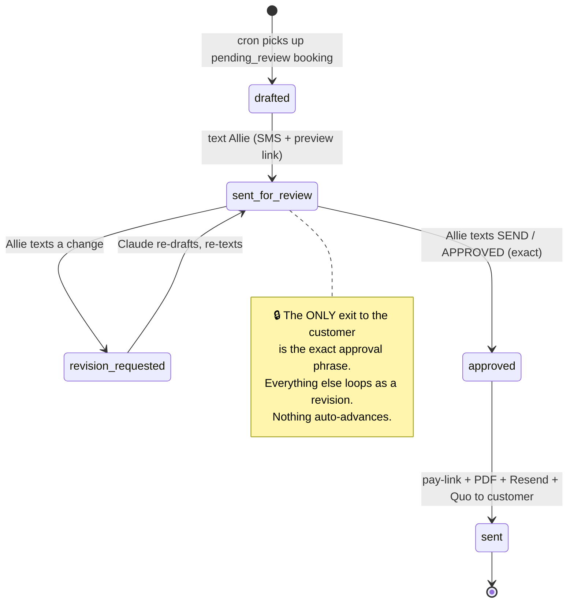

# Inquiry → Draft Response — Process Flow

Visual companion to `docs/inquiry-response-workflow.md` and the planning session
(2026-08-31). Reflects the resolved build decisions: flat **$250 deposit** all
party types (Studio = security deposit, no hold), **conversational SMS review
loop**, **server-side Claude API** drafting, all three party types.

Legend: **▭ actions** · **◇ gates/decisions** · **▱ human (Allie)** ·
🔒 = hard guardrail (never bypass).

---

## 1. End-to-end flow

```mermaid
flowchart TD
    A["Customer submits site form<br/>(party-builder / quote / studio-rental)"] --> B["POST /api/checkout"]
    B --> C{"requires_deposit?"}
    C -->|"No — free booking"| C1["bookings row<br/>status = confirmed"]:::out
    C1 --> Cx["Out of scope<br/>(no drafting)"]:::out
    C -->|"Yes — party request"| D["bookings row<br/>status = pending_review<br/>💡 THE TRIGGER"]:::trigger

    D --> E["Cron: /api/cron/draft-inquiries<br/>(CRON_SECRET, cron-job.org)<br/>polls pending_review w/ no draft yet"]
    E --> F{"Classify party type<br/>from event_type / package_type"}

    F -->|"studio-rental"| G["Studio Rental rules"]
    F -->|"mobile-party"| H["Mobile Party rules"]
    F -->|"party-packages"| I["In-Studio Theme rules"]

    G --> J{"REQUIRED-INFO GATE<br/>all core fields present?"}
    H --> J
    I --> J

    J -->|"Missing fields"| K["Draft = INFO-GATHER only<br/>🔒 no pricing, no quote<br/>ask for the missing fields"]:::draft
    J -->|"Complete"| L["Draft = QUOTE PATH<br/>$250 deposit + party-type rules<br/>starting rate / line items"]:::draft

    K --> M["Claude API writes<br/>{ emailDraft, smsDraft }<br/>🔒 signed as Allie"]
    L --> M
    M --> N["Write inquiry_drafts row<br/>status = sent_for_review<br/>+ short code + preview token"]
    N --> O["Text Allie via Quo (+1 631 998 9325):<br/>'[HH-2026-0042 · Studio] draft ready.<br/>SMS: …  Preview: (token link)<br/>Reply SEND, or say what to change'"]:::sms

    O --> P["Allie reads on her phone<br/>+ opens preview link<br/>(email + invoice PDF)"]:::human
    P --> Q["Allie texts a reply"]:::human
    Q --> R["Inbound: /api/webhooks/quo"]

    R --> S{"from == ALLIE_PHONE<br/>AND an open draft exists?"}
    S -->|"No"| S1["Existing customer logic<br/>(STOP / opt-out / log)"]:::out
    S -->|"Yes"| T{"🔒 APPROVAL GATE<br/>exact phrase?<br/>SEND / SEND IT / APPROVED"}

    T -->|"No — anything else"| U["Treat as REVISION<br/>Claude re-drafts with her note"]:::draft
    U --> N

    T -->|"Yes"| V["DETERMINISTIC ASSEMBLY (code, not LLM)"]:::send
    V --> V1["1 · pay-link API<br/>linkType=payment_link, +3% card fee<br/>🔒 fee on BALANCE only, never deposit"]
    V1 --> V2["2 · build invoice from _template.html<br/>→ render PDF (headless Chrome)"]
    V2 --> V3["3 · Resend email → CUSTOMER<br/>PDF + HTML + pay links inline"]
    V3 --> V4["4 · Quo SMS → CUSTOMER<br/>🔒 both signed as Allie"]
    V4 --> W["inquiry_drafts status = sent"]:::done

    classDef trigger fill:#fde68a,stroke:#b45309,color:#111;
    classDef draft fill:#dbeafe,stroke:#1d4ed8,color:#111;
    classDef sms fill:#e9d5ff,stroke:#7c3aed,color:#111;
    classDef send fill:#bbf7d0,stroke:#15803d,color:#111;
    classDef human fill:#fbcfe8,stroke:#be185d,color:#111;
    classDef out fill:#e5e7eb,stroke:#6b7280,color:#111;
    classDef done fill:#86efac,stroke:#166534,color:#111;
```



---

## 2. Draft state machine (`inquiry_drafts`)



---

## 3. Required-info gate — what each party type needs before a QUOTE (vs. info-gather)

| Field | Studio Rental | Mobile Party | In-Studio Theme |
|---|---|---|---|
| **Contact name** | **required** | **required** | **required** |
| **Contact phone** | **required** | **required** | **required** |
| **Contact email** | **required** | **required** | **required** |
| Date | required | required | required |
| Start time | required | required | required |
| **Rental duration** | **required** | n/a | n/a |
| Guest count | required | required | required |
| Turning age | n/a | nice to have | nice to have |
| Child's name | n/a | nice to have | nice to have |
| **Venue address** | n/a (at studio) | **required** | n/a (at studio) |
| Theme | optional | required-ish | required (package) |
| **If any required field missing** | → **info-gather draft, no pricing** 🔒 | → **info-gather draft, no pricing** 🔒 | → **info-gather draft, no pricing** 🔒 |
| **If all present** | quote: base rate for the duration **+ additional-hour rate** + $250 sec-deposit (no hold) | quote: package + $250 deposit credited to total | quote: package price + $250 deposit; **portal-auth link, not Stripe** |

---

## 4. Hard guardrails (🔒) — enforced in code, not left to the model

1. **No message ever auto-sends.** Customer send happens only after the exact approval phrase.
2. **Every customer-facing message is signed "Allie"** — email and SMS.
3. **Never send customer email via Gmail MCP.** Resend only (Brevo for the relay path).
4. **Pay-link via the API** (`linkType=payment_link`, never-expiring); **3% card fee on the balance only, never on the deposit.**
5. **Email carries both PDF and HTML + inline pay links** — don't bet on one attachment format (§5 vs §5f conflict).
6. **$250 deposit is fixed** — never inferred, never 25%, no $500 auth hold.
7. **Info-gather first** whenever a required field is missing — no pricing in that first contact.
```

