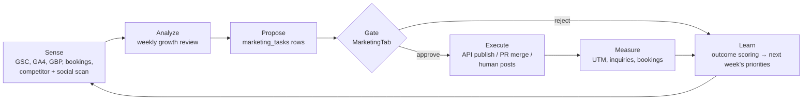

# Host Hampton Growth Agent — Build Plan

**Date:** 2026-09-05
**Goal:** a system that continually *measures, improves, markets, creates, and builds* for hosthampton.com with the owner as the approver, not the operator.
**Builds on:** the marketing graph already in `services/website` (`marketing_tasks`, `website_content`, `marketing_ledger`, `marketing_budget`, `advance()`, consent gate, MarketingTab), the SEO plan of record (`seo-action-plan-2026-09-04.md`), and the voice profile.

---

## 0. The shape of it in one paragraph

There is no single "agent process." There is a **weekly growth loop** with three execution layers, all writing into the same Postgres state so every action is gated, logged, and budgeted the same way:

| Layer | Runs where | Good for | Never does |
|---|---|---|---|
| **L1 — App nodes** | Next.js cron routes + Anthropic API (existing pattern) | Narrow, repeatable LLM jobs: draft a post, draft a reply, score an inquiry, snapshot metrics | Open-ended reasoning, code changes |
| **L2 — Claude Code routines** | Scheduled Claude Code sessions with repo + MCP access (`/schedule`, or Nimbalyst automations locally) | Open-ended work: weekly review, competitor scan, SEO/CRO code changes as PRs, research | Push to `main` (push = live deploy), publish anything |
| **L3 — Browser / human hands** | Claude in Chrome or Cowork on Adam's machine, or Allie's phone | Surfaces with no API or where automation is a ban risk: Facebook Groups, Instagram DMs, competitor IG profiles | Post without a human clicking |

Everything a layer *proposes* becomes a `marketing_tasks` row. Everything a layer *does* becomes a `marketing_ledger` row. The owner sees one queue in MarketingTab and approves or rejects. That is the whole design.

---

## 1. The loop

Cadence: **Sense/Analyze/Propose weekly** (Monday 06:00). **Execute** as approved. **Measure** continuously via UTM + inquiry source. **Learn** monthly (what produced inquiries, what didn't).

---

## 2. Roles (routines, not services)

Each is a prompt + tool set + schedule. They do not talk to each other in memory; they talk through the database.

| Role | Layer | Schedule | Inputs | Output (all as rows, never direct publish) |
|---|---|---|---|---|
| **Analyst** | L2 | Weekly | GSC, GA4, GBP insights, bookings/inquiries table, ledger | `metric_snapshots` row + `weekly-review-YYYY-MM-DD.md` + ranked `marketing_tasks` (task_type `growth_action`) |
| **Scout** | L2 (+ L3 for IG/FB reads) | Weekly | Competitor site list, their IG/FB pages, GBP listings, ad library | `competitor_snapshots` rows; diffs since last week (new pages, prices, offers, post cadence, review count) → tasks |
| **Copywriter** | L1 | Weekly batch + on demand | Voice profile, approved calendar, real party photos (consent-gated), FAQ, seasonal windows | `marketing_tasks` `social_post` / `gbp_post` / `newsletter` drafts, `pending_review` |
| **Community** | L1 draft, L3 post | Daily | Pasted or fetched FB group threads, GBP Q&A, reviews, IG comments | `fb_reply` / `gbp_review_reply` / `gbp_qa_answer` drafts, `pending_review` |
| **Builder** | L2 | Weekly, gated on Analyst output | Approved `growth_action` tasks that require code (retitle, new page, schema, CRO test) | A **pull request** with tests green; task → `executing`; owner merges → deploy |
| **Publisher** | L1 | Every 15 min | `approved` social/GBP tasks | Meta Graph API / GBP API calls; task → `done`; ledger `send` row |

Approval tiers (already in the schema):
- `AUTO_EXECUTE`: metric snapshots, competitor snapshots, drafting, PR *creation*. Costs tokens only.
- `ALWAYS_ASK`: anything customer-visible: publishing a post, replying to a review, merging a PR, sending a newsletter, anything with a child's image (consent trigger is the backstop).

---

## 3. Channel-by-channel: what can be automated honestly

This is where the request needs one correction. "Post and respond in FB groups" cannot be automated safely and should not be attempted.

| Channel | API exists? | Automation policy | How |
|---|---|---|---|
| **Facebook Page** (Host Hampton) | Yes, Meta Graph API | Draft auto, publish after approval | Publisher node, `pages_manage_posts` |
| **Instagram Business** | Yes, Graph API (feed, reels, carousel; comments read/reply) | Draft auto, publish after approval; comment replies drafted, sent after approval | Publisher node, requires IG connected to the Page |
| **Facebook Groups** | **No.** Groups API was removed in 2024. | **Agent drafts, human posts.** This is the standing decision (SEO plan C-7) and it stays. Browser automation posting from Allie's personal account is a real account-ban risk and Meta explicitly prohibits it. | Community node drafts; Claude in Chrome can *pre-fill* the post box on Adam's screen but a person clicks Post |
| **Google Business Profile** | Yes, Business Profile API (posts, reviews, Q&A, insights). Requires a Google approval application, typically 1–3 weeks. | Draft auto, publish after approval | Publisher node once API access is granted; **Claude in Chrome as the interim**, human clicks |
| **Instagram/FB DMs** | Partial (Messenger Platform, IG messaging; needs app review) | Draft only. Human sends. | Community node |
| **Competitor IG/FB reading** | No public API | **Read-only browsing** in Claude in Chrome or Cowork, weekly, from a logged-in-or-not session; screenshots + text into `competitor_snapshots` | Scout, L3 |
| **Competitor websites** | n/a | Fetch + diff weekly | Scout, L2, `WebFetch` |
| **Competitor ads** | Meta Ad Library (public) + Adspirer `competitor_ads_research` MCP | Auto | Scout, L2 |
| **Email newsletter** | Resend (already wired) | Draft auto (existing `draft-newsletter` cron), send after approval | existing |
| **SMS** | Twilio/Quo (wired) | Transactional + review asks only; **no marketing SMS** without A2P + consent | existing |

**Rule:** any time the agent needs a human's logged-in personal account, the human is the one who clicks. The agent's job is to make that click take 10 seconds.

---

## 4. Build phases

### Phase 0 — Connect the senses (owner + 1 session, ~1 week)

Nothing in this plan can *learn* without measurement. This is the same blocker the SEO plan named as the top action.

| # | Item | Who | Notes |
|---|---|---|---|
| 0.1 | Connect **Google Search Console** + submit sitemap | Adam | Adspirer MCP already exposes GSC; needs the property verified |
| 0.2 | Connect **GA4** (tag already in layout? verify) | Adam + session | Adspirer `google_analytics` |
| 0.3 | Create **Meta app** (Business type), connect the Page + IG Business account, get a long-lived Page token; store as `META_PAGE_TOKEN`, `META_PAGE_ID`, `IG_USER_ID` | Adam (auth) + session (code) | Permissions: `pages_manage_posts`, `pages_read_engagement`, `instagram_basic`, `instagram_content_publish`, `instagram_manage_comments` |
| 0.4 | Apply for **Google Business Profile API** access | Adam | Interim = Chrome, human-clicked |
| 0.5 | Confirm the **competitor list** (5–8 named businesses) | Adam | Seed from `chief-of-seo-playbook.md` §3 and the deep review |
| 0.6 | Confirm **FB groups list** and the posting rules of each | Adam/Allie | Drafts must respect each group's self-promo rules |
| 0.7 | Set **monthly budgets**: LLM spend, paid ads (if any), listing fees | Adam | Writes to `marketing_budget` |
| 0.8 | Photo library with consent state: where are usable party photos, which have signed releases | Allie | Feeds the consent gate |

### Phase 1 — The weekly loop skeleton (1–2 sessions)

- **Migration 029:** `metric_snapshots` (date, source, metric, value, dimension JSONB) and `competitor_snapshots` (competitor, url, captured_at, content_hash, extracted JSONB, diff_summary).
- **Migration 030:** extend `marketing_tasks.task_type` set with `growth_action`, `social_post`, `gbp_post`, `gbp_review_reply`, `gbp_qa_answer`, `code_change`; add `channel`, `scheduled_for`, `external_id` columns.
- **`/api/cron/metrics-snapshot`** (L1): pull GSC/GA4/GBP/booking counts daily into `metric_snapshots`.
- **Analyst routine** (L2, `/schedule`, weekly): reads snapshots + ledger + the SEO plan; writes `docs/marketing/weekly/YYYY-MM-DD.md`; inserts ranked `growth_action` tasks with an *evidence* field. Hard rule: every proposal cites a number from a snapshot or is labelled "hypothesis".
- **MarketingTab:** add a "This week" view: tasks grouped by role, one-click approve/reject, evidence shown inline.
- **Standing-decisions file** `docs/marketing/do-not-repropose.md` that every routine must read first (trucker-hat-bar stays, no bulk town copy, no WebSite schema, no FB group automation, no service-history claims in `locations.ts`).

### Phase 2 — Publishing (2 sessions)

- **`lib/marketing/publishers/meta.ts`**: create Page post, create IG media container + publish, reply to comment. Rate-limit aware, idempotent by `external_id`.
- **`lib/marketing/publishers/gbp.ts`**: local post, review reply, Q&A answer (behind a feature flag until API access lands).
- **`/api/cron/publisher`** every 15 min: `approved` + `scheduled_for <= now()` → publish → `done` + ledger `send`. Uses `advance()`; fails closed.
- **Copywriter batch** (L1 weekly cron): 5 Page/IG posts + 2 GBP posts per week from a content calendar the Analyst maintains (seasonal windows: Halloween by Sep 15, holiday parties, winter break camps, spring birthdays, summer rentals). All `pending_review`.
- **Image handling:** posts referencing party photos must link a `consent_releases` row in `signed` status, or use studio/product photos. Existing DB trigger enforces this for `website_content`; extend the trigger to `marketing_tasks` with `context.media_consent_id`.
- **Attribution:** every published link carries `utm_source/medium/campaign` (reuse `reviewLink.ts` pattern); inquiry form already captures source; Publisher writes the UTM to the task so the Learn step can join.

### Phase 3 — The Builder (2 sessions, then ongoing)

- **Builder routine** (L2, weekly, after Analyst): takes `growth_action` tasks with `context.requires_code = true` that are `approved`; opens a branch `growth/<task-id>-<slug>`; makes the change; runs `npm test` + `tsc` + a **clean-checkout build** (lesson from the failed A-1 deploy); opens a PR with the task evidence in the body; task → `executing`.
- **Never** pushes `main`. Merging is the owner's click and *is* the deploy.
- First candidate tasks already exist in the SEO plan: A-2 (retitle money pages), A-4 (sitemap lastmod), A-5 (home H1), A-6 (`Organization` schema), A-7 (`Offer` schema), A-8 (breadcrumbs on craft pages), B-4, B-5, B-6.
- **CRO experiments:** a tiny flag table (`experiments`) + a cookie-bucketed variant helper so the Builder can propose headline/CTA tests measured by inquiry rate, not vibes.
- Scope limits in the routine prompt: touch only `services/website/src`, never nginx/compose/env, never pricing or rate engine without an explicit owner task.

### Phase 4 — Community and competitor intelligence (1–2 sessions + recurring human time)

- **Scout routine** (L2 weekly): fetch competitor pages, diff vs last snapshot, pull Meta Ad Library, GBP review counts; write `competitor_snapshots`; propose tasks only on *material* diffs (new service page, price change, new offer, review velocity > ours).
- **Scout browser pass** (L3, weekly, 15 min): Claude in Chrome opens each competitor's IG and FB page, records post cadence, top formats, offers; saves a short note per competitor into the snapshot table via the admin API. Read-only.
- **Community inbox** (L1 + L3, daily): Adam or Allie pastes new group threads / questions (or Chrome reads them from the open tab); `fb-reply` route already drafts; expand it to GBP Q&A and review replies. Human posts. Track every draft used or not in the ledger so the drafts improve.
- **FB group calendar:** Analyst proposes 1–2 group-appropriate posts/week (value-first, per group rules). Human posts from their own account.

### Phase 5 — Learn (1 session, then monthly)

- Monthly `outcomes` job: join ledger `send` rows → UTM → inquiries → bookings. Produce per-channel and per-content-type cost per inquiry.
- Analyst reads outcomes and re-weights next month's calendar. Kill/scale rules from the SEO plan (day-90 town rule) run here on real numbers.
- Voice profile v2: fold in approved edits the owner made to drafts (diff between draft and what was actually posted) so drafts converge on Allie's voice.

---

## 5. Guardrails (non-negotiable, encoded not remembered)

1. `advance()` remains the only status writer; publish is gated to admin actors. Cron cannot publish.
2. Consent trigger blocks any child-media publish without a signed release; extend to social tasks.
3. Budget breakers: LLM spend check-before / record-after on every node; Publisher refuses if monthly send count exceeds the cap.
4. No PII in the repo, ever (`contacts_real.csv`, `invoices/`, `revenue/`, `audit_scratch/` stay untracked and go in `.gitignore`).
5. No Facebook Group automation. No personal-account automation. No DM sending.
6. Builder opens PRs only; a green clean-checkout build is required before the PR is opened.
7. Every routine reads `do-not-repropose.md` first and cites evidence or labels hypothesis.
8. Rate limits and idempotency keys on every external write.
9. Weekly cost report in the review doc; kill switch = one env flag `GROWTH_AGENT_ENABLED`.

---

## 6. Cost sketch

| Item | Est. monthly |
|---|---|
| L1 LLM nodes (Haiku 4.5, ~200 drafts) | under $5 |
| L2 routines (Sonnet/Opus, 4 weekly Analyst + 4 Scout + 4 Builder runs) | $30–80 depending on model |
| Meta / GBP APIs | $0 |
| Human time: approvals + group posting | ~1–2 hrs/week |
| Optional: The Bash Pro, ad spend | per SEO plan |

---

## 7. Owner decisions needed before Phase 1

1. Competitor list (5–8 names).
2. FB groups list and each group's promo rules; who posts (Adam or Allie).
3. Monthly LLM budget and whether any paid ads are in scope.
4. Meta Business Manager access: who owns the Page and IG; can a Meta app be created under it.
5. Posting cadence you're comfortable approving weekly (default: 5 social, 2 GBP, 1 group post).
6. Which routine runner: Claude Code cloud `/schedule` (needs GitHub repo access) vs Nimbalyst automations on Adam's PC (needs the PC on). Recommendation: cloud for Analyst/Scout/Builder, local Chrome for L3.

---

## 8. First three sessions to spawn

1. **"Growth agent Phase 0+1: migrations, metrics snapshot cron, Analyst routine, MarketingTab weekly view"** (Opus). Deliverable: the first weekly review lands as tasks in MarketingTab.
2. **"Meta Graph publisher + publisher cron + Copywriter batch"** (Opus). Blocked on 0.3.
3. **"Scout: competitor snapshot + diff + weekly browser pass procedure"** (Sonnet). Blocked on 0.5.
